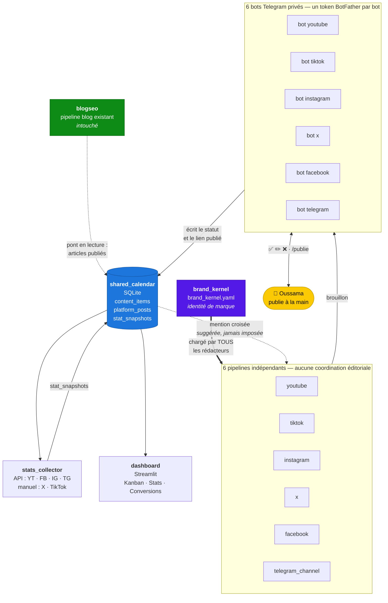
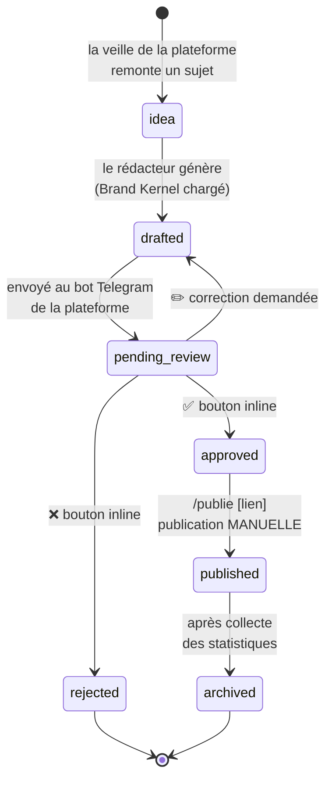
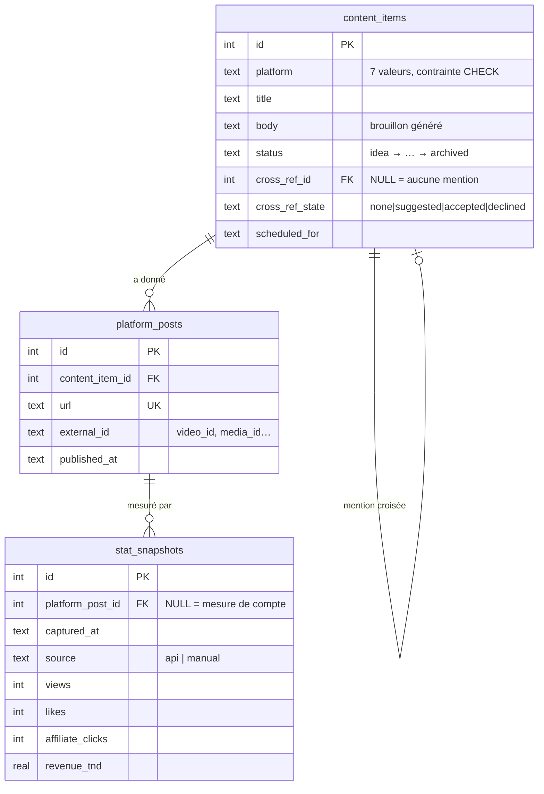

# ARCHITECTURE.md — pilotage multi-plateformes

> **Périmètre de ce document : l'extension multi-plateformes uniquement.**
> L'architecture du pipeline blog existant est décrite dans
> [`docs/ARCHITECTURE.md`](docs/ARCHITECTURE.md) et ne change pas d'une ligne.
>
> Document de cadrage associé : [`CADRAGE.md`](CADRAGE.md).
> **État : squelette.** Aucun module décrit ici ne contient encore de logique métier.

---

## 1. Le principe : ajouter à côté, jamais modifier

Le système `blogseo` fonctionne. La règle de cette extension est donc simple :

> **Tout est ajout. Rien n'est modifié.**

Concrètement, `src/pilotage/` est un paquet Python **frère** de `src/blogseo/`,
pas un sous-module. Les deux vivent dans le même dépôt, partagent le même
`.venv`, le même `.env` et les mêmes conventions — mais ne s'importent jamais.

```
src/
├── blogseo/     ← existant, 10 agents, Clean Architecture 4 couches — INTOUCHÉ
└── pilotage/    ← nouveau, 6 pipelines indépendants
```

**Règle d'isolation, vérifiée automatiquement** par
`tests/unit/test_pilotage_scaffolding.py` :

| Interdit | Pourquoi |
|---|---|
| `pilotage` importe `blogseo` | Le pilotage ne doit pas casser quand le blog évolue |
| `blogseo` importe `pilotage` | Le pipeline blog doit tourner même sans le pilotage |

Le seul point de contact est **la base SQLite du calendrier partagé**, écrite
de part et d'autre par un pont dédié — jamais par un import croisé.

---

## 2. Arborescence

```
blog-seo-agents/
├── ARCHITECTURE.md                  ← ce fichier
├── CADRAGE.md                       ← lots, risques, décisions à figer
├── docs/ARCHITECTURE.md             ← architecture du pipeline blog (inchangée)
│
└── src/
    ├── blogseo/                     ← INTOUCHÉ
    │
    └── pilotage/
        ├── platforms.py             ← enum Platform : la seule constante partagée
        │
        ├── brand_kernel/            ← LA seule dépendance commune aux 6 pipelines
        │   ├── brand_kernel.yaml    ← identité de marque (couleurs, ton, slogan, offres)
        │   ├── schema.py            ← dataclasses miroir du YAML
        │   └── loader.py            ← load_brand_kernel() + render_prompt_block()
        │
        ├── shared_calendar/         ← connexion inter-plateforme, OPTIONNELLE
        │   ├── schema.sql           ← content_items · platform_posts · stat_snapshots
        │   ├── migrate.py           ← application du schéma (rejouable)
        │   ├── models.py            ← entités Python
        │   └── repository.py        ← seul endroit où du SQL est écrit
        │
        ├── pipelines/               ← 6 pipelines INDÉPENDANTS
        │   ├── base.py              ← contrat commun (watch → choose → write → submit)
        │   ├── youtube/             ← watcher.py · writer.py · spec.py
        │   ├── tiktok/              ← idem
        │   ├── instagram/           ← idem
        │   ├── x/                   ← idem
        │   ├── facebook/            ← idem
        │   └── telegram_channel/    ← idem
        │
        ├── bots/                    ← 6 bots Telegram PRIVÉS de pilotage
        │   ├── base.py              ← long-polling, clavier inline, garde chat_id
        │   ├── youtube/             ← handlers.py
        │   └── … (5 autres)
        │
        ├── stats_collector/         ← collecte des statistiques
        │   ├── base.py              ← port StatsCollector
        │   ├── youtube_api.py       ← Data API v3          (auto)
        │   ├── meta_graph.py        ← Facebook + Instagram (auto)
        │   ├── telegram_api.py      ← Bot API              (auto)
        │   └── manual_entry.py      ← X + TikTok          (saisie guidée)
        │
        ├── dashboard/               ← Streamlit local
        │   ├── app.py
        │   └── views/               ← kanban.py · stats.py · conversions.py
        │
        └── config/
            └── settings.py          ← PilotageSettings.from_env()
```

**Pourquoi `src/pilotage/` et pas des dossiers à la racine.** `pyproject.toml`
déclare un *src-layout* (`[tool.setuptools.packages.find] where = ["src"]`).
Un dossier `brand_kernel/` posé à la racine ne serait pas installé par
`pip install -e .` et ne serait importable qu'au prix d'un bricolage de
`sys.path`. Le paquet frère coûte un niveau de dossier et règle le problème.

---

## 3. Comment les modules s'articulent



Trois choses à retenir de ce schéma :

1. **La flèche épaisse est la seule obligatoire.** Le Brand Kernel descend
   vers les six pipelines, toujours. Tout le reste est optionnel.
2. **La flèche en pointillés du calendrier vers les pipelines est une
   suggestion.** Un pipeline peut consulter le calendrier pour proposer une
   mention croisée ; il n'y est jamais forcé, et la suggestion passe par la
   validation manuelle du bot avant d'exister.
3. **Rien ne part du pilotage vers `blogseo`.** Le pont blog → calendrier est
   en lecture seule et vit du côté du pilotage.

---

## 4. Cycle de vie d'un contenu



**La publication reste manuelle sur les six plateformes.** Aucune API de
publication gratuite n'est fiable sur ce périmètre, et publier automatiquement
sur six comptes est un risque disproportionné. Le bot enregistre le lien après
coup — ce qui suffit au collecteur de statistiques et au tableau de bord.

Ces sept états sont exactement les colonnes du Kanban.

---

## 5. Le schéma de données en un coup d'œil



`stat_snapshots` **accumule** : on n'écrase jamais une mesure, on en ajoute
une. C'est ce qui permet au tableau de bord de tracer une courbe plutôt qu'un
chiffre isolé.

---

## 6. Exécution : hybride Actions / local

Décision prise avec l'auteur, formalisée en
[ADR 0009](docs/adr/0009-execution-hybride-pilotage.md). Elle nuance
[l'ADR 0005](docs/adr/0005-scheduler-local-plutot-que-github-actions.md), qui
avait rejeté GitHub Actions pour le blog — pour une raison qui ne s'applique
qu'au blog : le bouton ❌ doit écrire sur le disque de l'auteur.

| Étage | Où | Pourquoi |
|---|---|---|
| Veille + rédaction des brouillons | **GitHub Actions** (gratuit sur dépôt public) | Tourne même PC éteint ; ne produit que du texte |
| Bots Telegram, calendrier, dashboard | **Local** (APScheduler, comme `blogseo`) | La base SQLite et les décisions vivent sur le disque de l'auteur |

**Le point dur de cette décision** est le transport des brouillons entre les
deux étages : un job Actions ne peut pas écrire dans une SQLite locale. Trois
options sont sur la table (commit d'artefacts JSON, artifact de workflow relu
par le poste local, ou bot Actions qui pousse directement dans Telegram) —
aucune n'est tranchée. Voir [`CADRAGE.md`](CADRAGE.md), risque n°1.

Tant que ce point n'est pas réglé, **tout tourne en local** : c'est le repli sûr.

---

## 7. Conventions reprises de l'existant

Le nouveau code suit les règles déjà en vigueur dans `blogseo` — ce ne sont pas
des préférences de style, chacune vient d'un problème réellement rencontré :

| Convention | Origine |
|---|---|
| Dataclasses `frozen=True, slots=True` | Config immuable ; ⚠️ avec `slots=True`, une valeur par défaut n'est **pas** lisible via la classe — utiliser des constantes de module |
| `class X(str, Enum)`, jamais `StrEnum` | Les valeurs sont sérialisées telles quelles (SQLite, `callback_data` Telegram) — voir la note `UP042` de `pyproject.toml` |
| Aucune clé d'API en dur, jamais | Tout passe par `.env` ; `describe()` affiche « configurée / absente » |
| Telegram en REST brut (`requests`) | Pas d'asyncio, pas de `python-telegram-bot` : long-polling simple à raisonner |
| Une source morte dégrade, ne bloque pas | Une veille en panne ne doit jamais empêcher de produire |
| Documentation et code en français | Cohérence avec tout le dépôt |

**Dépendances ajoutées : une seule.** `streamlit` (Apache 2.0, gratuit, local).
`PyYAML`, `requests` et `apscheduler` sont déjà là ; `sqlite3` est dans la
bibliothèque standard. La contrainte « jamais de carte bancaire » est tenue.

---

## 8. État de l'implémentation et mise en service

Les lots 1 à 7 sont implémentés : chargement du Brand Kernel, calendrier
SQLite et pont blog en lecture seule, six pipelines indépendants, six bots
Telegram, collecte de statistiques, dashboard Streamlit et tests E2E hors
ligne. Les commandes sont exposées par `pilotage` : `migrate`, `check`,
`sync-blog`, `run`, `bot`, `remind-stats` et `collect-stats`.

La logique est prête, mais les appels réels dépendent des comptes et clés
externes dans `.env` : bots Telegram par plateforme, API YouTube, Meta et
canal Telegram. Le chemin de mise en service et les décisions encore attendues
sont tenus à jour dans [`CADRAGE.md`](CADRAGE.md).
