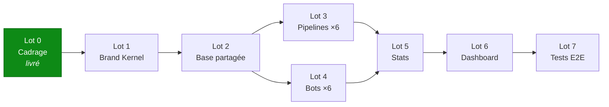

# CADRAGE.md — pilotage multi-plateformes

> Document de cadrage de l'extension multi-plateformes du projet
> `blogseo-agents`. Il fixe le périmètre, découpe le travail en lots, liste les
> risques et recense les décisions à figer **avant** d'écrire la première ligne
> de logique métier.
>
> Architecture : [`ARCHITECTURE.md`](ARCHITECTURE.md) · Historique du projet :
> [`MEMOIRE.md`](MEMOIRE.md) · Backlog v1 : [`docs/BACKLOG.md`](docs/BACKLOG.md)
>
> | | |
> |---|---|
> | **Date** | 2026-08-23 |
> | **Statut** | Cadrage validé, squelette livré, développement non commencé |
> | **Dépôt** | https://github.com/dallel5-git/Multi_agent_blog_SEO |

---

## 1. Objectif

Ajouter, **à côté** du système multi-agents blog existant, un système de
pilotage de contenu pour six plateformes : YouTube, TikTok, Instagram, X,
Facebook et un canal Telegram public.

Ce qui existe déjà et ne bouge pas : les 10 agents du pipeline blog,
l'orchestration LangGraph, la validation Telegram des articles, la publication
Git vers le blog Next.js. Voir [`docs/ARCHITECTURE.md`](docs/ARCHITECTURE.md).

---

## 2. Les quatre contraintes structurantes

### 2.1 Indépendance éditoriale totale entre plateformes

Chaque pipeline a **sa** veille, choisit **ses** sujets, suit **son**
calendrier. Rien n'impose que deux plateformes traitent le même sujet le même
jour. C'est un choix éditorial assumé : un format court TikTok et une vidéo
longue YouTube n'ont ni le même rythme ni le même public.

**Conséquence de conception :** aucun module ne doit pouvoir imposer un sujet à
un pipeline. Un « orchestrateur global » qui distribuerait les sujets serait
une erreur d'architecture, pas une optimisation.

### 2.2 Le Brand Kernel est la seule chose obligatoirement partagée

Un fichier YAML unique — couleurs, logo, police, ton de voix, slogan, cible,
offres d'affiliation actives — chargé par **tous** les rédacteurs avant toute
génération. Changer le ton de voix à un seul endroit doit changer le ton des
six plateformes.

### 2.3 La connexion inter-plateforme est légère et optionnelle

Un calendrier partagé en SQLite que chaque pipeline **peut** consulter pour
**suggérer** une mention croisée vers un contenu publié ailleurs. Jamais
imposée, toujours validée à la main.

### 2.4 100 % gratuit, jamais de carte bancaire

Reprise sans changement de la contrainte n°1 du projet
([MEMOIRE.md §2](MEMOIRE.md), [ADR 0003](docs/adr/0003-stack-100-pourcent-gratuite.md)).

| Besoin | Service | Coût | Clé |
|---|---|---|---|
| LLM | Groq → OpenRouter ×2 → Gemini (déjà en place) | 0 € | free tier |
| Base de données | SQLite (bibliothèque standard) | 0 € | aucune |
| Bots de pilotage | Telegram Bot API | 0 € | BotFather |
| Stats YouTube | Data API v3 — 10 000 unités/jour | 0 € | clé simple |
| Stats Facebook / Instagram | Meta Graph API | 0 € | jeton de page |
| Stats Telegram | Bot API | 0 € | le bot du canal |
| Stats X / TikTok | **aucune API gratuite** → saisie manuelle | 0 € | — |
| Tableau de bord | Streamlit, exécution locale | 0 € | aucune |
| Exécution périodique | GitHub Actions (dépôt public) + APScheduler local | 0 € | aucune |

**Une seule dépendance ajoutée : `streamlit`.** Tout le reste est déjà installé
ou fait partie de la bibliothèque standard.

---

## 3. Découpage en lots

Ordre de dépendance stricte : chaque lot ne peut commencer que lorsque le
précédent est testé. Le lot 0 est déjà livré.

### Lot 0 — Cadrage et squelette ✅ *livré*

Analyse de l'existant, arborescence `src/pilotage/`, `brand_kernel.yaml`,
`schema.sql`, `.env.example` étendu, `ARCHITECTURE.md`, ce document, et les
tests de non-régression du squelette.

### Lot 1 — Brand Kernel

Le premier parce que tout le reste en dépend. Dataclasses miroir du YAML,
`load_brand_kernel()` avec cache, **refus de démarrer s'il reste un `TODO`**,
et `render_prompt_block()` qui produit le bloc injecté en tête des prompts.

*Bloqué par :* les valeurs d'identité que l'auteur doit fournir (§5, décisions 1 et 2).

### Lot 2 — Base de données partagée

`migrate.py` applique `schema.sql`. `models.py` définit les entités et l'énum
`ContentStatus`. `repository.py` concentre **tout** le SQL. `config/settings.py`
lit l'environnement. Plus le pont lecture seule qui verse les articles publiés
du blog dans `content_items`.

### Lot 3 — Les 6 pipelines de contenu

`pipelines/base.py` d'abord, puis **un pipeline complet de bout en bout comme
pilote** avant de dupliquer sur les cinq autres. Recommandation : YouTube en
premier — c'est la plateforme avec des stats automatiques, la meilleure boucle
de rétroaction pour valider le modèle.

*Chaque pipeline = une issue distincte, testable seule.*

### Lot 4 — Les 6 bots Telegram de pilotage

`bots/base.py` (long-polling, offset persisté, clavier inline, garde sur le
`chat_id` autorisé), puis un bot par plateforme : `/en_attente`, `/stats`,
`/publie [lien]`, boutons ✅ ✏️ ❌.

### Lot 5 — Agent Collecteur de Statistiques

Port commun, puis les adapters : YouTube, Meta (Facebook + Instagram),
Telegram, et la saisie manuelle guidée pour X et TikTok.

*Bloqué par :* la mise en place administrative Meta (§4, risque 3).

### Lot 6 — Tableau de bord Streamlit

Kanban par plateforme, statistiques dans le temps, suivi des conversions.
Lecture seule : le tableau de bord n'écrit jamais en base.

### Lot 7 — Tests bout-en-bout

Un run complet d'un pipeline en mode hors ligne, du sujet au brouillon
enregistré en base, sans réseau ni clé — sur le modèle du `make offline`
existant, qui est aujourd'hui le meilleur filet du projet.

---

## 4. Risques identifiés

### Risque 1 — Le transport Actions → local n'est pas résolu · ⚠️ bloquant

L'exécution hybride retenue fait tourner la veille et la rédaction sur GitHub
Actions, mais la base SQLite et les bots vivent sur le poste de l'auteur. **Un
job Actions ne peut pas écrire dans une base locale.**

Trois options, aucune tranchée :

| Option | Avantage | Coût |
|---|---|---|
| Actions commite les brouillons en JSON dans le dépôt | Simple, versionné, gratuit | Pollue l'historique Git |
| Actions publie un *artifact*, le poste local le récupère | Historique propre | Le poste doit interroger l'API ; artifacts conservés 90 jours |
| Actions envoie directement dans Telegram, le bot local écrit en base | Aucun transport de fichier | Le token de bot devient un secret GitHub |

**Repli sûr en attendant : tout en local.** Le système est fonctionnel ainsi ;
Actions n'est qu'une commodité. À formaliser en ADR 0009.

### Risque 2 — Six pipelines, c'est six fois la charge éditoriale

Six plateformes à alimenter, c'est six flux à relire et valider — à la main,
puisque la publication reste manuelle. Le goulot d'étranglement n'est pas
technique, il est humain.

*Mitigation :* commencer par **deux** plateformes réellement alimentées
(recommandation : YouTube + une seconde), mesurer le temps de validation
hebdomadaire réel, puis étendre. Le squelette prévoit les six ; rien n'oblige
à les activer tous.

### Risque 3 — La mise en place Meta est longue et administrative

Facebook et Instagram exigent, avant la moindre ligne de code : un compte Meta
Business, une Page Facebook, un compte Instagram **Business** relié à cette
Page, une application Meta, et un jeton de page longue durée. Le jeton expire
au bout d'environ **60 jours** et se renouvelle à la main.

*Mitigation :* démarrer cette création dès maintenant, en parallèle des lots 1
et 2 ; prévoir un rappel de renouvellement dans le bot.

### Risque 4 — X et TikTok n'ont pas d'API d'engagement gratuite

Les chiffres de ces deux plateformes seront saisis à la main. Une saisie
manuelle non tenue, ce sont deux plateformes aveugles dans le tableau de bord.

*Mitigation :* rappel hebdomadaire du bot, qui liste les publications sans
mesure récente et demande les chiffres un par un. Marquer ces mesures
`source = "manual"` pour ne jamais les confondre avec des mesures d'API.

### Risque 5 — Confusion entre les objets Telegram du projet

Trois choses différentes portent le mot « Telegram » :

| Objet | Rôle | Variable |
|---|---|---|
| Bot de validation du blog | Valide les articles (existant) | `TELEGRAM_BOT_TOKEN` |
| 6 bots de pilotage | Reçoivent les brouillons des 6 plateformes | `PILOTAGE_*_BOT_TOKEN` |
| Canal Telegram public | **Cible de publication**, pas un outil | `TELEGRAM_CHANNEL_USERNAME` |

*Mitigation :* préfixe `PILOTAGE_` systématique, et un rappel dans le
docstring de `pilotage/bots/__init__.py`.

### Risque 6 — Le suivi des conversions dépend d'une saisie fiable

L'onglet Conversions du tableau de bord n'affichera que ce qui aura été
enregistré. Les clics d'affiliation ne remontent que si les liens portent un
paramètre de suivi par plateforme, et les ventes de produits digitaux devront
sans doute être saisies à la main.

*Mitigation :* décider du schéma de paramètre de suivi **avant** le lot 1
(décision 6), puisqu'il vit dans le Brand Kernel.

### Risque 7 — Dérive du squelette

Un squelette non implémenté vieillit mal : au moment d'écrire le lot 3, les
docstrings peuvent décrire une architecture qui n'a plus de sens.

*Mitigation :* `tests/unit/test_pilotage_scaffolding.py` verrouille déjà
l'ossature (isolation des paquets, présence des 6 pipelines et 6 bots, clés du
Brand Kernel, schéma SQL applicable). Toute dérive fait échouer `make test`.

---

## 5. Checklist des décisions à figer avant de coder

> À trancher dans l'ordre. Les six premières bloquent le lot 1.

- [ ] **1. Identité visuelle** — les cinq couleurs (primaire, secondaire,
      accent, fond, texte) en hexadécimal, le chemin du logo, et les deux
      polices (titre et corps, libres de droits). *Bloque le lot 1.*

- [ ] **2. Ton de voix** — trois à cinq adjectifs, **tutoiement ou
      vouvoiement** (à figer une fois pour les six plateformes), formules
      signature, politique emoji. *Bloque le lot 1.*

- [ ] **3. Baseline** — la phrase de 10-15 mots des bios de profil, distincte
      du slogan « Prenez le contrôle de votre temps grâce à l'IA ». *Bloque le lot 1.*

- [ ] **4. Comptes et handles** — les URL réelles des comptes TikTok,
      Instagram, X, Facebook et du canal Telegram. Certains n'existent
      peut-être pas encore : les créer fait partie du lot 1. *Bloque le lot 1.*

- [ ] **5. Offres d'affiliation** — les programmes n8n et Make sont-ils déjà
      souscrits ? Liens d'affiliation réels, commissions, appels à l'action.
      Y a-t-il un produit digital propre à vendre dès maintenant ? *Bloque le lot 1.*

- [ ] **6. Paramètre de suivi des liens** — schéma exact du paramètre par
      plateforme (par exemple `?ref=od-youtube`), sans quoi l'onglet
      Conversions ne pourra rien ventiler. *Bloque le lot 1.*

- [ ] **7. Noms exacts des 6 bots** — les `@handles` BotFather, à réserver tant
      qu'ils sont libres. Suggestion cohérente : `@od_pilot_youtube_bot`,
      `@od_pilot_tiktok_bot`, etc. *Bloque le lot 4.*

- [ ] **8. Cadence par plateforme** — nombre de publications par semaine et
      fenêtre horaire, pour chacune des six. C'est ce qui détermine la charge
      de validation hebdomadaire (risque 2). *Bloque le lot 3.*

- [ ] **9. Format de contenu attendu par plateforme** — script vidéo YouTube ou
      simple plan ? Légende Instagram seule ou avec brief visuel ? Thread X ou
      post unique ? *Bloque le lot 3.*

- [ ] **10. Plateformes réellement activées au démarrage** — les six d'un coup,
      ou deux en pilote ? Recommandation : deux (risque 2). *Bloque le lot 3.*

- [ ] **11. Sources de veille par plateforme** — les mêmes que le blog (HN,
      Reddit, dev.to, RSS) ou des sources spécifiques ? *Bloque le lot 3.*

- [ ] **12. Transport Actions → local** — trancher entre les trois options du
      risque 1, ou confirmer le repli « tout en local ». *Bloque le passage en
      exécution hybride, pas le développement.*

- [ ] **13. Statistiques du canal Telegram** — se limiter au nombre d'abonnés
      (accessible au bot) ou saisir les vues par message à la main ? *Bloque le lot 5.*

- [ ] **14. Mise en place Meta** — compte Business, Page, compte Instagram
      Business relié, application Meta. *Bloque le lot 5 — à démarrer dès maintenant.*

---

## 6. Ce qui a été livré dans le lot 0

| Fichier | Contenu |
|---|---|
| `ARCHITECTURE.md` | Arborescence, schémas Mermaid, règle d'isolation, conventions |
| `CADRAGE.md` | Ce document |
| `src/pilotage/` | 63 fichiers de squelette, docstrings uniquement |
| `src/pilotage/platforms.py` | Énum `Platform` — la seule constante partagée |
| `src/pilotage/brand_kernel/brand_kernel.yaml` | Structure complète, valeurs en `TODO` explicites |
| `src/pilotage/shared_calendar/schema.sql` | 3 tables, 1 vue, contraintes `CHECK` et clés étrangères |
| `.env.example` | Sections 11 à 14 : 6 bots, YouTube, Meta, base, dashboard |
| `tests/unit/test_pilotage_scaffolding.py` | Verrouillage de l'ossature |

**Aucune logique métier** : pas d'appel LLM, pas d'appel Telegram, pas de
requête SQL en dehors de la création du schéma. Le code existant de `blogseo`
n'a pas été modifié d'une ligne.
